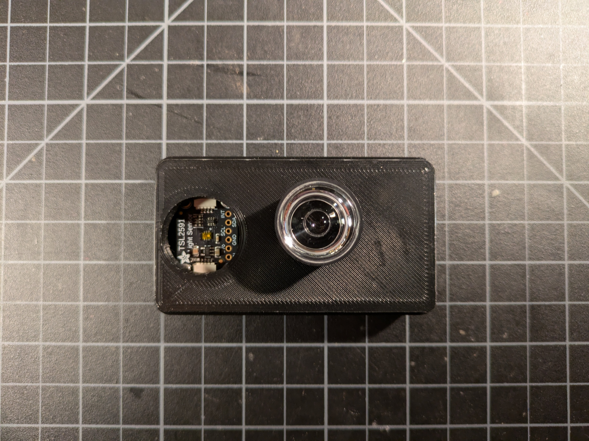

# night-sky-measurement
Build and code for optical night sky measurements

Calibration will require the use of an SQM-L device from https://www.unihedron.com/projects/sqm-l/

## Build Steps:
1. Solder the pins onto the QtPy
2. Connect the uFL antenna to the QtPy
3. Connect TSL2591 via STEMMA cable to QtPy
4. Solder the pins onto the display
5. Download Thonny (https://thonny.org)
6. Install Circuit Python onto QtPy via Thonny (put chp into boot mode first!)
7. Download Circuit Python libraries (https://circuitpython.org/libraries)
8. Add necessary libraries to Circuit Python drive under lib directory
   * adafruit_bus_device
   * adafruit_tsl2591.mpy
   * adafruit_displayio_ssd1306.mpy
   * adafruit_ssd1306.mpy
   * adafruit_display_text
9. Run example from https://github.com/adafruit/Adafruit_CircuitPython_TSL2591/blob/main/examples/tsl2591_simpletest.py
10. Copy code.py from this project and test display and sensor
11. Package into case
12. Calibrate
13. Bonus - connection to wifi + adafruit.io

## Build Steps explained:

### Breadboard layout (1)
* This picture shows the nomimal layout of the breadboard to get started
* Start by pressing the QtPy headers into the rows shown and soldering the QtPy to the headers

### QtPy with antenna (2)
* The uFL antenna is tricky to connect and requires a decent amount of force
* After soldering the QtPy to the headers on a breadboard verify the antenna connects

### Attach TSL2591 (3)
* Attach the TSL2591 sensor via the STEMMA QT cable

### Attach oled display (4)
* Attach the oled display
* Wire the 5V, GND, SCL and SDA over to the oled break out

### Setup CircuitPython (5-8)
* Download Thonny (https://thonny.org)
* Setup for CircuitPython (set interpreter, see screenshot)

* Update firmware (put chip into boot mode, see screenshot)

* Download Circuit Python libraries (v9) (https://circuitpython.org/libraries)
* Install necesary libraries from Step 8 above
  * Copy files/folders into CIRCUITPY drive while board is plugged into computer

### Run test example
* Download python file from Step 9 (https://github.com/adafruit/Adafruit_CircuitPython_TSL2591/raw/refs/heads/main/examples/tsl2591_simpletest.py)
* Open python file with Thonny
* Run python file with board plugged into computer
  * Look for console output with the Total, Infrared, Visible and Full spectrum measurements
  * Occlude the TSL2591 sensor and ensure values drop in magnitude

### Install code
* Download this project's python code into the CIRCUITPY drive
* One can run the code, skip calibration and see uncalibrated sensor readings on display to verify

### Package the project
* 3D print the [upper](case/case_upper.stl) and [lower](case/case.stl) cases

* Thread the internal posts with the m2 screws (requires a little bit of force)
* Move QtPy onto proto board and solder

* Solder display wires onto proto board

* Mount sensor and display (ensure display lines up with hole)

* Mount proto board and adhere the antenna

* Mask or disable the Green LED on the TSL2591
  * One can use gaffer tape or scratch the LED connection

* Close up the case and install the lens

* Power on and verify working display

* Run calibration steps
  * Start up Thonny
  * Plug in USB
  * Hit Y to begin calibration
  * Follow prompts for readings with SQM-L
